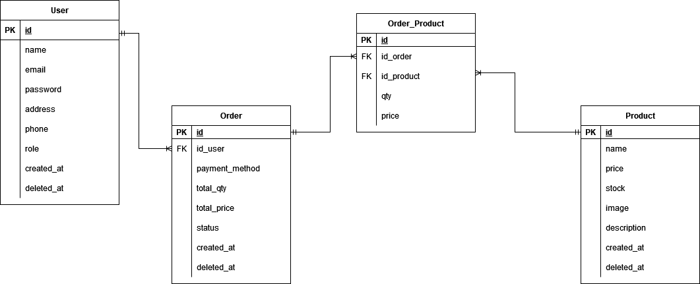

# Clothing Online Store Group 2

<!-- ABOUT THE PROJECT -->

## 👗 About The Project 👕

An online retailer called Clothing Online Store carries a selection of clothing from different nations. To serve the demands of Indonesians looking to purchase foreign clothing online, this online retailer was established.

</details>   
       
### 💄 &nbsp;Build App & Database 💍


## 👚 ERD 👒



## Run Locally

Clone the project

```bash
  git clone https://github.com/faqihassyfa/PROJECT-III.git
```

Go to the project directory

```bash
  cd PROJECT-III
```

## Open Api 🔥

If you're interested in using our Open Api, this is an example of how to do so.

```bash
https://virtserver.swaggerhub.com/vaniliacahya/E-Store/1.0.0
```

<div>
      <details>
<summary>👶 Users</summary>
  
  <!---
  | Command | Description |
| --- | --- |
  --->
  
This is an explanation of the Users section's CRUD method.
 
<div>
  
| Feature User | Endpoint | Param | JWT Token | Function |
| --- | --- | --- | --- | --- |
| GET | /users  | - | YES | Users obtain their account information in this form.  |
| POST | /users | - | NO | This is how users register their account |
| Delete | /users | - | YES | Delete user account |
| PUT | /users | - | YES | Update user account |
| GET | /login | - | NO | This is how users log in. |

</details>

       
<div>
      <details>
<summary>🦊 Admin</summary>
  
  <!---
  | Command | Description |
| --- | --- |
  --->
  
Several commands make use of admin features, as shown below.
 
<div>
  
| Feature Admin | Endpoint | Param | JWT Token | Function |
| --- | --- | --- | --- | --- |
| PUT | /admins/:productid  | ID Product | YES | Update Product data |
| DELETE| /admins/:productid | ID Product | YES | Delete Product |
| POST | /admins | - | YES | Create product |
| GET | /admins | - | YES | Displaying recently posted products |
| GET | /admins/history | - | YES | show the order history for existing orders |

</details>   

<div>
      <details>
<summary>🛒 Order</summary>
  
  <!---
  | Command | Description |
| --- | --- |
  --->
  
Several commands make use of Order features, as shown below.
 
<div>
  
| Feature Order | Endpoint | Param | JWT Token | Function |
| --- | --- | --- | --- | --- |
| GET | /orders  | - | YES | Create Order data |


</details>   

## Authors 👑

- Cindy Sinthia Imanisa Febryana
       
  Reach me:

  [](https://github.com/Cindy05-shintia)

- Vanilia Cahya Nugroho
       
  Reach me:

  [](https://github.com/vaniliacahya)
  
- Faqih Assyfa Poedjiono
       
  Reach me:

  [](https://github.com/faqihassyfa)

       
 <p align="right">(<a href="#top">back to top</a>)</p>
<h3>
<p align="center">:copyright: 2022 </p>
</h3>
<!-- end -->
